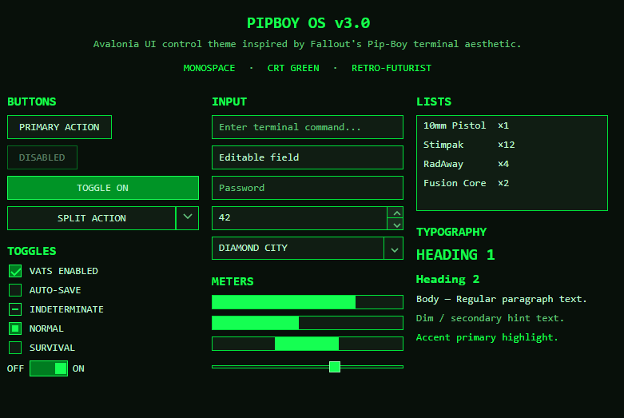
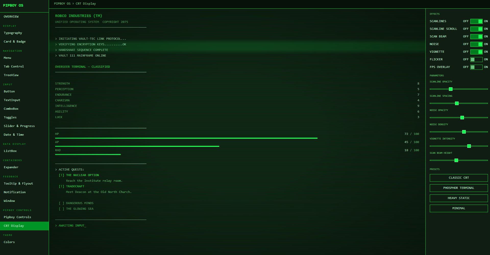
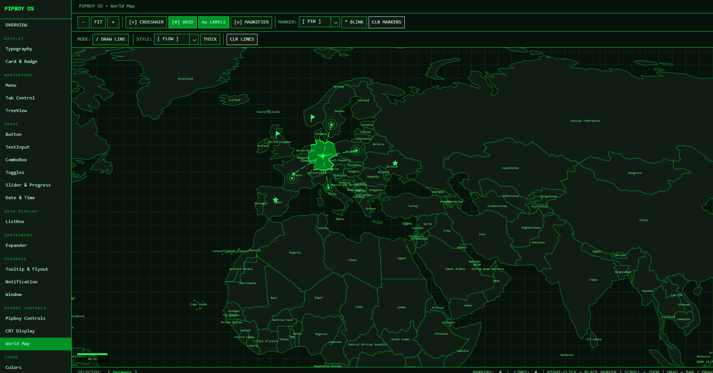

# Pipboy.Avalonia

[](https://claude.ai/claude-code)
[](https://www.nuget.org/packages/Pipboy.Avalonia)
[](https://nevermorewd.github.io/Pipboy.Avalonia/)

A Fallout 4 Pip-Boy inspired theme library for [Avalonia UI](https://avaloniaui.net/).

Sharp corners, monochromatic phosphor palette, retro terminal aesthetic — drop it in as your sole application theme and every standard control gets the Vault-Tec treatment.

**[▶ Try the live WASM demo](https://nevermorewd.github.io/Pipboy.Avalonia/)** — runs entirely in the browser, no install needed.

> A significant portion of this codebase was written with [Claude Code](https://claude.ai/claude-code).

---

## Screenshots

<!-- Desktop -->


<!-- Runtime color switching -->



---

## Features

- **Full control coverage** — Button, RepeatButton, HyperlinkButton, SplitButton, DropDownButton, TextBox, CheckBox, RadioButton, ToggleButton, ToggleSwitch, Slider, ProgressBar, ScrollBar, ListBox, ComboBox, TreeView, TabControl, Menu, ContextMenu, Expander, NumericUpDown, AutoCompleteBox, DatePicker, TimePicker, CalendarDatePicker, SplitView, GridSplitter, ToolTip, FlyoutPresenter, DataValidationErrors, Notification, and more.
- **Runtime color switching** — change the primary color at any time; all brush resources and CRT effects update instantly — no layout passes triggered.
- **Monochromatic palette** — the entire color system is derived from a single HSL primary color. Hover, pressed, selection, border, and background variants are computed automatically.
- **Purpose-built controls** — `CrtDisplay`, `PipboyWindow`, `PipboyTitleBar`, `PipboyCountdown`, `PipboyPanel`, `SegmentedBar`, `RatedAttribute`, `BracketHighlight`, `PipboyTabStrip`, `TerminalPanel`, `BlinkText`, `ScanlineOverlay`.
- **MVVM-ready** — all custom controls expose `ICommand` properties (`CompletedCommand`, `ClosedCommand`) alongside routed events for pure MVVM usage.
- **No rounded corners** — all controls use `CornerRadius="0"` by design.
- **Zero third-party dependencies** — only `Avalonia` is referenced.
- **AOT / trimming compatible** — compiled XAML bindings, `IsTrimmable`, and `IsAotCompatible` all enabled.
- **`net10.0`** primary target.
- **Multi-platform** — Desktop (Windows, macOS, Linux), Browser (WASM), Android, iOS.
- **Typography utility classes** — `h1`, `h2`, `dim`, `accent`, `error`, `warning`, `success` for `TextBlock`; `pipboy-panel`, `pipboy-surface` for `Border`.

---

## Platform Support

| Platform | Project suffix | Notes |
|----------|---------------|-------|
| Windows / macOS / Linux | `.Desktop` | `IClassicDesktopStyleApplicationLifetime` |
| Browser (WASM) | `.Browser` | `net8.0-browser`, `Avalonia.Browser` |
| Android | `.Android` | `net8.0-android` |
| iOS | `.iOS` | `net8.0-ios` |

---

## Installation

```
dotnet add package Pipboy.Avalonia
```

---

## Quick Start

### 1. Apply the theme in `App.axaml`

```xml
<Application xmlns="https://github.com/avaloniaui"
             xmlns:x="http://schemas.microsoft.com/winfx/2006/xaml"
             xmlns:pipboy="clr-namespace:Pipboy.Avalonia;assembly=Pipboy.Avalonia"
             x:Class="MyApp.App">
  <Application.Styles>
    <pipboy:PipboyTheme />
  </Application.Styles>
</Application>
```

`PipboyTheme` is a self-contained `Styles` collection — no base Fluent/Simple theme required.

### 2. (Optional) Set the primary color at startup

```csharp
// In App.axaml.cs or Program.cs — before the window is shown
PipboyThemeManager.Instance.SetPrimaryColor(Color.Parse("#FFA500")); // Amber
```

The default color is phosphor green (`#4CAF50`-ish).

### 3. (Optional) Change color at runtime

```csharp
PipboyThemeManager.Instance.SetPrimaryColor(Color.Parse("#00BFFF")); // Blue
```

Subscribe to `ThemeColorChanged` if you need to react to changes:

```csharp
PipboyThemeManager.Instance.ThemeColorChanged += (_, e) =>
{
    // e.Palette exposes all computed colors
};
```


---

## Typography Classes

Apply directly on `TextBlock`:

| Class | Effect |
|-------|--------|
| `h1` | 20 px, bold, primary color |
| `h2` | 16 px, bold, primary color |
| `dim` | Dimmed foreground (`PipboyTextDimBrush`) |
| `accent` | Primary color foreground |
| `error` | Error red foreground |
| `warning` | Warning amber foreground |
| `success` | Success green foreground |

```xml
<TextBlock Classes="h2" Text="INVENTORY"/>
<TextBlock Classes="dim" Text="Weight: 12.4 lbs"/>
<TextBlock Classes="error" Text="ENCUMBERED"/>
```

## Layout Classes

Apply on `Border`:

| Class | Effect |
|-------|--------|
| `pipboy-panel` | Elevated surface (`PipboySurfaceHighBrush`) with border + 8 px padding |
| `pipboy-surface` | Flat surface (`PipboySurfaceBrush`) with border |

```xml
<Border Classes="pipboy-panel">
  <TextBlock Text="SECTION CONTENT"/>
</Border>
```

---

## Custom Controls

Pipboy.Avalonia ships purpose-built controls that go beyond Avalonia's built-in set.

### SegmentedBar

Displays a value as discrete rectangular segments — the iconic Fallout HP/AP/RAD bar style.

```xml
<pipboy:SegmentedBar Label="HP" Value="78" Maximum="100" SegmentCount="20" />
```

<!-- SCREENSHOT PLACEHOLDER: docs/images/screenshot-segmentedbar.png -->

### RatedAttribute

Shows a named attribute with filled/empty dot indicators — S.P.E.C.I.A.L. style.

```xml
<pipboy:RatedAttribute Label="STRENGTH" Value="8" Maximum="10" />
```

<!-- SCREENSHOT PLACEHOLDER: docs/images/screenshot-ratedattribute.png -->

### BlinkText

Wraps any content with a configurable blink animation (pure XAML — WASM safe).

```xml
<pipboy:BlinkText IsBlinking="True">
    <TextBlock Classes="accent" Text="PRESS ENTER TO CONTINUE" />
</pipboy:BlinkText>
```

<!-- SCREENSHOT PLACEHOLDER: docs/images/screenshot-blinktext.png -->

### ScanlineOverlay

A `Decorator` that draws repeating CRT-style horizontal scanlines over its child using `DrawingContext` (no unsafe code, WASM safe).

```xml
<pipboy:ScanlineOverlay LineSpacing="4" LineOpacity="0.08">
    <Border Classes="pipboy-panel">
        <TextBlock Text="ROBCO INDUSTRIES" />
    </Border>
</pipboy:ScanlineOverlay>
```

<!-- SCREENSHOT PLACEHOLDER: docs/images/screenshot-scanlineoverlay.png -->

### BracketHighlight

Wraps content with animated `> ... <` bracket indicators on hover or when `IsSelected=true`.

```xml
<pipboy:BracketHighlight IsSelected="True">
    <TextBlock Text="INVENTORY" />
</pipboy:BracketHighlight>
```

<!-- SCREENSHOT PLACEHOLDER: docs/images/screenshot-brackethighlight.png -->

### PipboyTabStrip

Horizontal tab-strip navigation with bracket indicators and D-Pad Left/Right keyboard support for gamepad use.

```xml
<pipboy:PipboyTabStrip SelectedIndex="0">
    <pipboy:PipboyTabStripItem Content="STAT" />
    <pipboy:PipboyTabStripItem Content="INV" />
    <pipboy:PipboyTabStripItem Content="DATA" />
    <pipboy:PipboyTabStripItem Content="MAP" />
    <pipboy:PipboyTabStripItem Content="RADIO" />
</pipboy:PipboyTabStrip>
```

<!-- SCREENSHOT PLACEHOLDER: docs/images/screenshot-pipboytabstrip.png -->

### TerminalPanel

A container styled as a Fallout terminal screen. Supports `TypewriterEffect` for character-by-character text reveal using `DispatcherTimer` (WASM safe).

```xml
<pipboy:TerminalPanel TypewriterEffect="True" TypewriterDelayMs="40"
    Content="ACCESSING VAULT-TEC MAINFRAME...&#x0a;CONNECTION ESTABLISHED." />
```

<!-- SCREENSHOT PLACEHOLDER: docs/images/screenshot-terminalpanel.png -->

### CrtDisplay

A `Panel` that layers animated CRT monitor effects over its content using only managed `DrawingContext` APIs — fully WASM-safe and AOT-compatible.
Effects are independently toggleable: **scanlines**, **scan beam**, **static noise**, **vignette**, and **flicker**.
The scan beam color automatically follows the active theme by default; explicitly setting `ScanBeamColor` opts out of auto-tracking.

```xml
<pipboy:CrtDisplay EnableScanBeam="True" EnableScanlines="True" EnableVignette="True"
                   EnableNoise="True" ScanBeamSpeed="55" VignetteIntensity="0.4">
    <Border Background="{DynamicResource PipboySurfaceBrush}">
        <!-- your content -->
    </Border>
</pipboy:CrtDisplay>
```

### PipboyWindow / PipboyTitleBar

A custom `Window` with a fully themed chrome: draggable title bar with `TitleBarContent` injection slot, working Minimize/Maximize/Close buttons, and a right-click system menu (Minimize / Maximize·Restore / Close). `PipboyTitleBar` is the same chrome as a standalone control for embedding inside other layouts.

```xml
<pipboy:PipboyWindow Title="VAULT-TEC OS">
    <pipboy:PipboyWindow.TitleBarContent>
        <pipboy:BlinkText IsBlinking="True">
            <TextBlock Classes="accent" FontSize="10" Text="● ONLINE" />
        </pipboy:BlinkText>
    </pipboy:PipboyWindow.TitleBarContent>
    <!-- window content -->
</pipboy:PipboyWindow>
```

### PipboyCountdown

A countdown timer control with configurable precision (Seconds / Minutes / Hours / Milliseconds), a label, and a `Completed` event plus `CompletedCommand` for MVVM.

```xml
<pipboy:PipboyCountdown Duration="0:3:00" Label="SELF DESTRUCT"
                         Precision="Seconds" CompletedCommand="{Binding AlarmCommand}" />
```

### PipboyPanel

A titled, closable panel container. Raises a `Closed` routed event and `ClosedCommand` when the user dismisses it.

```xml
<pipboy:PipboyPanel Header="SYSTEM ALERT" Classes="warning">
    <TextBlock Text="Reactor core temperature critical." />
</pipboy:PipboyPanel>
```

---

## Design Tokens

All tokens are available as `{DynamicResource}` in XAML.

### Brushes

| Resource | Description |
|----------|-------------|
| `PipboyPrimaryBrush` | Primary brand color |
| `PipboyPrimaryLightBrush` | Lighter variant (highlights) |
| `PipboyPrimaryDarkBrush` | Darker variant (selected background) |
| `PipboyBackgroundBrush` | Window / deepest background |
| `PipboySurfaceBrush` | Card / panel background |
| `PipboySurfaceHighBrush` | Elevated panel background |
| `PipboyTextBrush` | Primary text |
| `PipboyTextDimBrush` | Secondary / label text |
| `PipboyBorderBrush` | Default control border |
| `PipboyBorderFocusBrush` | Focused control border |
| `PipboyHoverBrush` | Hover state background |
| `PipboyPressedBrush` | Pressed state background |
| `PipboySelectionBrush` | Selected item background |
| `PipboyFocusBrush` | Focus ring color |
| `PipboyDisabledBrush` | Disabled foreground |
| `PipboyErrorBrush` | Error severity (hue-derived, near-white lightness) |
| `PipboyWarningBrush` | Warning severity (hue-derived, bright lightness) |
| `PipboySuccessBrush` | Success severity (hue-derived, mid lightness) |

### Font Sizes

| Resource | Value |
|----------|-------|
| `PipboyFontSizeSmall` | 11 |
| `PipboyFontSize` | 13 |
| `PipboyFontSizeLarge` | 16 |

### Other

| Resource | Description |
|----------|-------------|
| `PipboyFontFamily` | `Consolas, Courier New, monospace` |
| `PipboyPrimaryColor` | Raw `Color` value of the primary |
| `PipboyBackgroundColor` | Raw `Color` of the background |
| `PipboyTextColor` | Raw `Color` of the text |

---

## Runtime Color Switching — How It Works

`PipboyTheme` registers `SolidColorBrush` instances as `DynamicResource` entries. When `PipboyThemeManager.SetPrimaryColor()` is called, `PipboyColorPalette` computes the full HSL-derived palette and `OnThemeColorChanged` mutates each brush's `.Color` in place. Avalonia's reactive binding system propagates the change to every bound control automatically — no re-layout, no template re-application.

```
SetPrimaryColor(color)
  └─ PipboyColorPalette(color)      — HSL-derive all palette colors
       └─ ThemeColorChanged event
            └─ PipboyTheme.OnThemeColorChanged()
                 └─ brush.Color = newColor  (× 18 brushes)
                      └─ DynamicResource invalidation → UI updates
```

`PipboyTheme` implements `IDisposable`. If you remove the theme from `Application.Styles` at runtime, call `Dispose()` to unsubscribe from `ThemeColorChanged` and avoid a memory leak.

---


---

## Supported Avalonia Version

**11.3.12** (tested). Compatible with Avalonia 11.x.

---

## License

MIT
